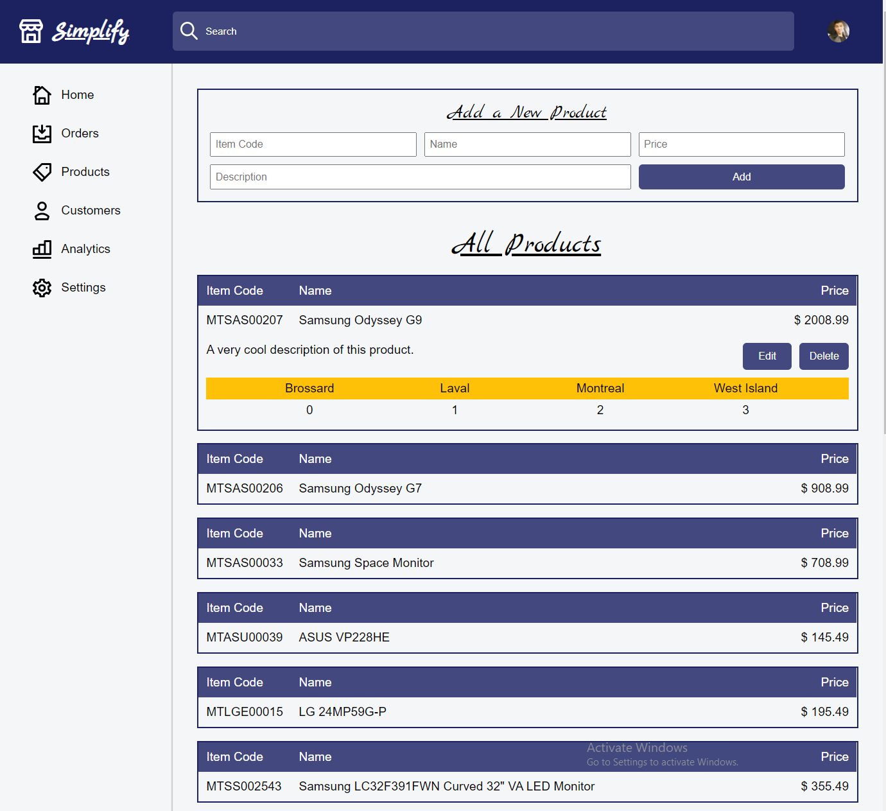
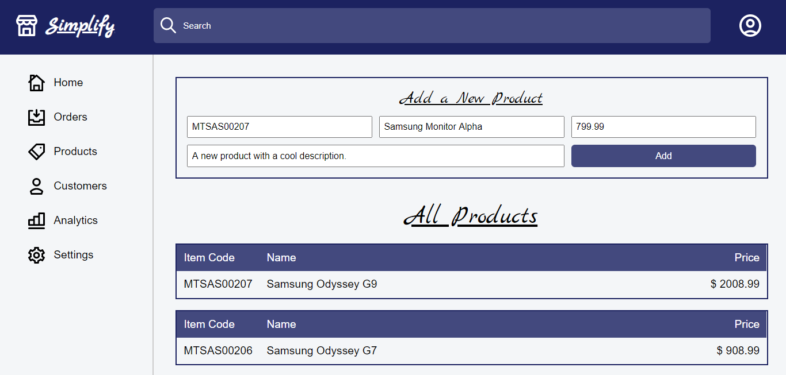
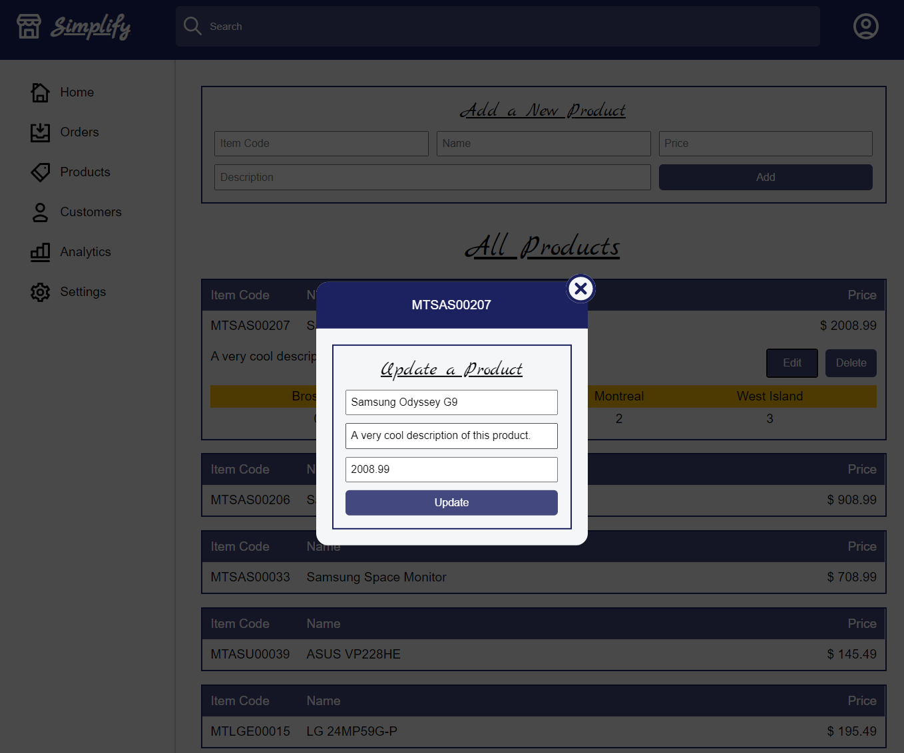
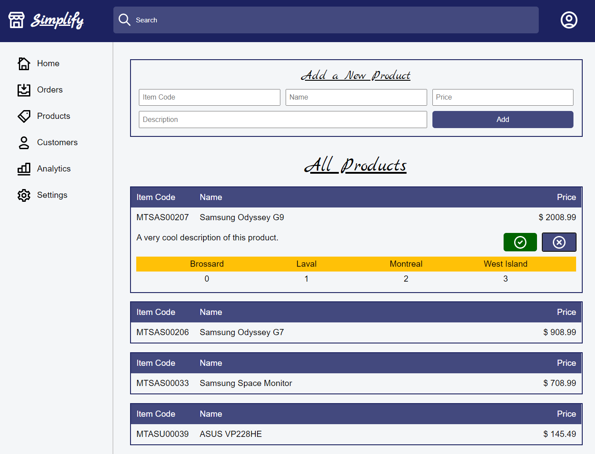
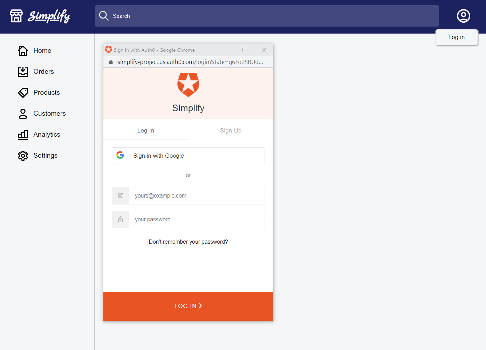

# Bootcamp Final Project (Work in Progress)

A retail backend platform for managing stores and simplifying daily tasks.

Features will include, but not limited to:
<ul>
  <li>CRUD Products</li>
  <li>CRUD Stores</li>
  <li>CRUD Employees</li>
  <li>CRUD Customers</li>
  <li>CRUD Sale Orders</li>
  <li>Inventory Count</li>
  <li>Inventory Transfers</li>
  <li>View Employee Performance</li>
  <li>View Store Numbers</li>
  <li>Goal Setting</li>
  <li>Chat System</li>
</ul>

## Technologies Used

<table>
  <tr>
    <th>Front End</th>
    <td>React</td>
    <td>Apollo Client</td>
    <td></td>
  </tr>
  
  <tr>
    <th>API</th>
    <td>Auth0</td>
    <td>GraphQL</td>
    <td></td>
  </tr>
  
  <tr>
    <th>Back End</th>
    <td>Node</td>
    <td>Apollo Server</td>
    <td>MongoDB</td>
  </tr>
</table>

## Extras
<ul>
  <li>Shopify Color Scheme</li>
  <li>Icons from Shopify Polaris</li>
  <li>Font by Marck Script</li>
</ul>

# Screenshots

## Products Section

## Add a Product

## Edit a Product

## Delete a Product

## User Authentication with Auth0

# Repo

<ul>
<li>+ Added</li>
<li>- Removed</li>
<li>* Modified</li>
</ul>
